# <div align="center"> DiagramX - AI-Powered Text to Diagram Generator</div>

<div align="center">
  
  


  **Transform your ideas into beautiful diagrams with the power of AI**
  
  [](https://diagramx-visualize-3d.lovable.app/)
  [](https://python.org)
  [](https://flask.palletsprojects.com)
  [](https://mermaid.js.org)
  [](LICENSE)

</div>

## ✨ Features

- 🤖 **AI-Powered Generation** - Convert natural language descriptions into professional diagrams
- 🎨 **Multiple Diagram Types** - Flowcharts, ER Diagrams, Sequence Diagrams, Class Diagrams, and more
- 🎯 **Real-time Preview** - See your diagrams update instantly as you type
- 🌈 **Theme Customization** - Choose from multiple beautiful themes
- 💾 **Export Options** - Download as SVG or PNG formats
- 📱 **Responsive Design** - Works seamlessly on desktop and mobile
- ⚡ **Fast & Efficient** - Powered by Groq's lightning-fast LLM API

## 🎯 Use Cases

- **Business Process Mapping** - Visualize workflows and procedures
- **Software Architecture** - Design system architectures and data flows
- **Educational Content** - Create diagrams for teaching and presentations
- **Project Planning** - Map out project timelines and dependencies
- **Database Design** - Generate ER diagrams for database schemas

  
## 🏗️ System Architecture


## 🛠️ Technology Stack

- **Backend**: Flask (Python)
- **Frontend**: HTML5, CSS3, JavaScript
- **AI Engine**: CrewAI + Groq LLM
- **Code Editor**: Monaco Editor
- **Diagram Rendering**: Mermaid.js
- **Deployment**: Render

## 🔄 Data Flow

```mermaid
sequenceDiagram
    participant User as 👤 User
    participant Frontend as 🖥️ Frontend
    participant Flask as 🐍 Flask API
    participant CrewAI as 🤖 CrewAI
    participant Groq as ⚡ Groq LLM
    participant Mermaid as 📊 Mermaid.js
    
    User->>Frontend: Enter diagram description
    User->>Frontend: Click "Generate Diagram"
    Frontend->>Flask: POST /generate-mermaid
    Flask->>CrewAI: Process description
    CrewAI->>Groq: Generate Mermaid code
    Groq-->>CrewAI: Return generated code
    CrewAI->>Groq: Optimize & enhance code
    Groq-->>CrewAI: Return optimized code
    CrewAI-->>Flask: Final Mermaid code
    Flask-->>Frontend: JSON response
    Frontend->>Mermaid: Render diagram
    Mermaid-->>Frontend: SVG diagram
    Frontend-->>User: Display diagram
```



## 🚀 Quick Start

### Prerequisites

- Python 3.8 or higher
- Groq API key (sign up at [Groq Console](https://console.groq.com))

### Installation

1. **Clone the repository**
   ```bash
   git clone https://github.com/yourusername/diagramx.git
   cd diagramx
   ```

2. **Install dependencies**
   ```bash
   pip install -r requirements.txt
   ```

3. **Set up environment variables**
   ```bash
   export GROQ_API_KEY="your_groq_api_key_here"
   ```

4. **Run the application**
   ```bash
   python app.py
   ```

5. **Open your browser** and navigate to `http://localhost:5000`

## 🛠️ Technology Stack

- **Backend**: Flask (Python)
- **Frontend**: HTML5, CSS3, JavaScript
- **AI Engine**: CrewAI + Groq LLM
- **Code Editor**: Monaco Editor
- **Diagram Rendering**: Mermaid.js
- **Deployment**: Render

## 📝 How to Use

1. **Describe your diagram** - Type a natural language description of what you want to visualize
2. **Generate** - Click "Generate Diagram" to let AI create the Mermaid code
3. **Customize** - Edit the generated code in the Monaco editor
4. **Export** - Download your diagram as SVG or PNG

### Example Descriptions

- "Create a flowchart for user login process"
- "Design an ER diagram for an e-commerce database"
- "Show a sequence diagram for API authentication"
- "Make a class diagram for a social media app"

## 🎨 Supported Diagram Types

| Type | Description | Example Use Case |
|------|-------------|------------------|
| **Flowchart** | Process flows and decision trees | Business workflows |
| **ER Diagram** | Entity-relationship models | Database design |
| **Sequence Diagram** | Interaction between objects | API communication |
| **Class Diagram** | Object-oriented design | Software architecture |
| **State Diagram** | State transitions | System behavior |

## 🤝 Contributing

We welcome contributions! Here's how you can help:

1. Fork the repository
2. Create a feature branch (`git checkout -b feature/amazing-feature`)
3. Commit your changes (`git commit -m 'Add amazing feature'`)
4. Push to the branch (`git push origin feature/amazing-feature`)
5. Open a Pull Request

## 📄 License

This project is licensed under the MIT License - see the [LICENSE](LICENSE) file for details.

## 🙏 Acknowledgments

- [Mermaid.js](https://mermaid.js.org) for the amazing diagram rendering
- [CrewAI](https://github.com/joaomdmoura/crewAI) for the AI agent framework
- [Groq](https://groq.com) for the fast LLM inference
- [Monaco Editor](https://microsoft.github.io/monaco-editor/) for the code editor

## 📊 Stats

<div align="center">
  
  
  
  

</div>

---

<div align="center">
  <strong>Made with ❤️ by Swapmil Patil</strong>
  <br>
  <sub>If you found this helpful, please consider giving it a ⭐</sub>
</div>


